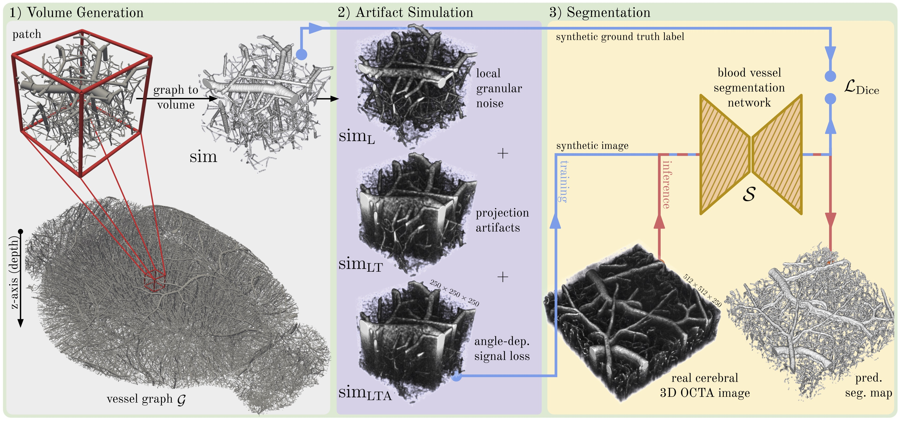

## Simulation-Based Segmentation of Vessels in Cerebral 3D OCTA Images



**TL;DR:** *First*, we selectively extract patches from vessel graphs that match the FOV and morphological characteristics of vasculature contained in cerebral OCTA images and transform them into voxelized volumes; *second*, we transform the voxelized volumes into synthetic cerebral 3D OCTA images by simulating the most dominant image acquisition artifacts; and *third*, we use our synthetic cerebral 3D OCTA images paired with their matching ground truth labels to train a blood vessel segmentation network, erasing the need for manual annotations.

Our work is described in detail in our manuscript ([Simulation-Based Segmentation of Blood Vessels in Cerebral 3D OCTA Images](https://arxiv.org/abs/2403.07116)).


## 🟢 Installation

Create a virtual environment using, for example, anaconda 

    conda create -n syn-cerebral-octa-seg python=3.8

and install relevant packages:

    pip install torch==1.13.1 --extra-index-url https://download.pytorch.org/whl/cu116

    pip install monai==1.0.1

    pip install scipy h5py SimpleITK scikit-image pyyaml tensorboard tqdm scikit-learn six

    pip install -e .

## 🟢 Data

To download the **synthetic cerebral 3D OCTA images** & our **manually annotated real 3D OCTA images**, please follow the instructions below:
<!--https://huggingface.co/docs/hub/en/datasets-downloading-->

    git lfs install                     # check whether git lfs is installed
    git clone git@hf.co:datasets/bwittmann/syn-cerebral-octa-seg

Folders containing **synthetic cerebral 3D OCTA images** and **manually annotated real 3D OCTA images** should be placed in `./dataset`:

```
dataset/
└── manual_annotations/
    └── mx_0.nii                    # real cerebral 3D OCTA image
    └── mx_0_label.nii              # ground truth (manual annotations) 
        ...
└── synthetic_cerebral_octa/
    └── axxxx_0/
        └── sim/
            └── sim_data_xx.npy     # synthetic cerebral 3D OCTA image
            └── sim_seg_xx.npy      # ground truth
        └── ang.npy                 # metadata angle
        └── occ.npy                 # metadata occupancy below
        └── rad.npy                 # metadata radius
        └── seg.npy                 # voxelized volume
    └── axxxx_1/
        ...   
```

The data is described in more detail on [Hugging Face 🤗](https://huggingface.co/datasets/bwittmann/syn-cerebral-octa-seg).

## 🟢 Create your own customized synthetic cerebral 3D OCTA images

One can either make use of our provided synthetic cerebral 3D OCTA images (`b421`) or finetune the simulation parameters to match the characteristics of OCTA images at hand.
To adjust the simulation, please run:

    python syn_cerebral_octa_seg/preprocess_sim.py --name <name> --angle_correction --len_tail 1.0 --gran_noise_std 1.4

Here, we solely adjust two parameters, `len_tail` (tail length factor) and `gran_noise_std` (granular noise standard deviation), following our example in the manuscript (see Fig. 7).


After the customized dataset has been created, adjust `sim_data_version` in `./syn_cerebral_octa_seg/config.yaml` to `<name>`.

## 🟢 Erase the need for manual annotations by training on synthetic images

To leverage the created synthetic cerebral 3D OCTA images for the sake of training a segmentation algorithm, simply run:

    python syn_cerebral_octa_seg/train.py

Parameters can be adjusted by modifying `./syn_cerebral_octa_seg/config.yaml`.
The parameters in the provided config file were tuned on the validation set and used in our experiments.

## 🟢 Evaluate the performance on the test set

To finally evaluate the trained segmentation algorithm on our provided manual annotations, please run:

    python syn_cerebral_octa_seg/test.py --run <name of experiment in ./runs folder> --last

Results can be accessed in `<name of experiment in ./runs folder>`.

## 🟢 Citation

If you find our work useful for your research, please consider citing our manuscript:
```bibtex
@misc{wittmann2024simulationbased,
      title={Simulation-Based Segmentation of Blood Vessels in Cerebral 3D OCTA Images}, 
      author={Bastian Wittmann and Lukas Glandorf and Johannes C. Paetzold and Tamaz Amiranashvili and Thomas Wälchli and Daniel Razansky and Bjoern Menze},
      year={2024},
      eprint={2403.07116},
      archivePrefix={arXiv},
      primaryClass={eess.IV}
}
```
